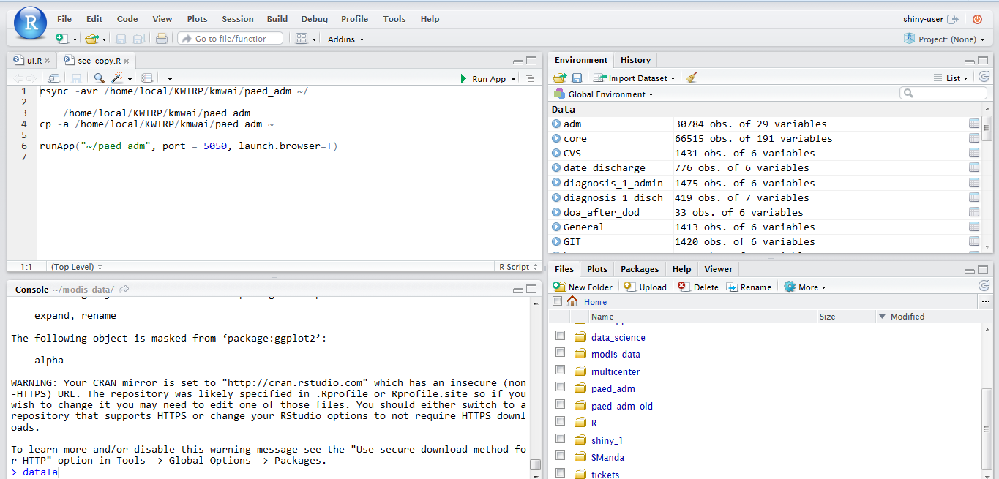
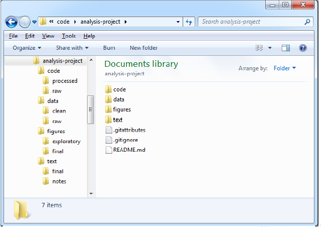
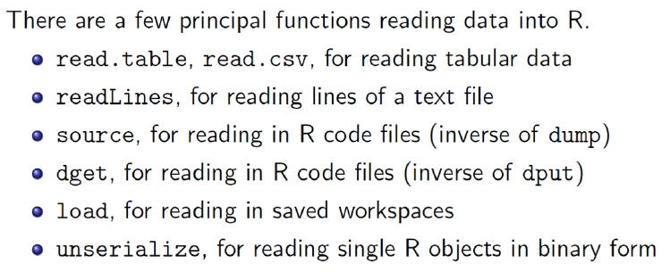

```{r setup, include=FALSE ,  tidy.opts=list(width.cutoff=50)}
knitr::opts_chunk$set(echo = TRUE,tidy.opts=list(width.cutoff=60),tidy=TRUE)
```

## Overview and History of R

  - R is a dialect of the S language.
  - S is a language that was developed by John Chambers and others at Bell Labs. S was initiated in 1976
  - R was created in 1991 – by Rose Ihaka and Robert Gentleman
  - In 1993 R was released to the public. 1997: R core group was formed 2000: R 1.0.0 was released
  - We are using R version 3.1.2 (2014-10-31) 


##Features of R
 - Runs on almost any standard computing platform/OS (even on the PlayStation 3)
 - Frequent releases (annual + bug_x releases); active development.
 - Useful for interactive work, but contains a powerful programming language for developing new tools (user --> programmer)


##Feature of R
 - Very active and vibrant user community; R-help and R-devel mailing lists and Stack Overflow – look at them on when at R help
 - It's free! (Both in the sense of beer and in the sense of speech.)

  
## How to setup Environment
 - Download  R from - The Comprehensive R Archive Network -http://cran.r-project.org/ and R Studio 
  - Available for the key OS \newline
  
 **R-studio?**
 -RStudio is the premier integrated development environment for R. - Download and install from http://www.rstudio.com/

**Why R-studio?**
 - RStudio's source editor includes a variety of productivity enhancing features including syntax highlighting, code completion, multiple-file editing, and find/replace, retrieving prev commands
 
## Types of people in the world

 - *There are **10 types of people** in this world, those who understand binary and those who dont*

## The Terms

  - **Object** R is an object oriented language and everything in R is an object. 
      - We store using **<-** or = operator ie  x <- 3 | x=3
  - **Vector** A collection of one or more objects of the same type . We use c() or vector()
  - **Function** A set of instructions carried out on one or more objects.
    - function *mean()* is used to calculate the arithmetic mean
  - **Operator** Is a symbol that has a pre-defined meaning. +\*-/
  - **Parameter** The kind of information that can be passed to a function – mean(age)

## Packages

  - A set of functions designed to perform more specific statistical or graphical tasks examples and documentation.
  - 4000+ packages found on the CRAN
  - To use packages in R, we must first install them using the install.packages()

## Data Types / Classes

  
Data Types          | Stores                    | 
--------------------|---------------------------|
real                | floating point numbers    | 
integer             | integers                  |
complex             | Complex numbers           |
factor              | categorical data          | 
character           | strings                   | 
logical             | TRUE or FALSe             | 
NA                  | Missing                   |
NULL                | Empty                     |
Function            | Function type             | 
--------------------|------------------------------

## RStudio Server Platform - Login


## Vector

- A vector can only contain objects of the same class

```{r }
a <- c(1,2,5.3,6,-2,4) # numeric vector
b <- c("one","two","three") # character vector
c <- c(TRUE,TRUE,TRUE,FALSE,TRUE,FALSE) #logical vector
```

## Matrices

  - All columns in a matrix must have the same class(numeric, character, etc.) and the same length. The general format is
```{r}
   #     mymatrix <- matrix(vector, nrow=r, ncol=c, byrow=FALSE,
      #     dimnames=list(char_vector_rownames, char_vector_colnames)) 
 #    byrow=TRUE indicates that the matrix should be filled by rows
```

## Factors
 - Used to represent categorical data. 
 - Can be unordered or ordered.
    -A factor is like an integer vector where each integer has a label.
```{r }
  x <- factor(c("yes", "yes", "no", "yes", "no"))
  x
```


## Missing Values
 - Missing values are represented by the symbol **NA** (not available)
 - Impossible values (e.g., dividing by zero) are represented by the symbol NaN (not a number)

 - Can be unordered or ordered.
    -A factor is like an integer vector where each integer has a label.
```{r }
  x <- NA
 # is.na(x) # returns TRUE of x is missing
# mean(x, na.rm=TRUE) # exclude missing in functions
# complete.cases() #returns the number of complete cases

```

## Data Frames

 - More general than a matrix, has different columns and can have different modes (numeric, character, factor, etc.)
 - Used to store tabular data
 - Can store data of different classes
 - *read.table()* or *read.csv()* – used to load dataframes
 
## Create Data Frames
```{r }
data.frame(foo = 1:4, bar = c(T, T, F, F))
x <- c(1, 2,3,4,5,6,7,8,9)
y <- c("a","b","c","d","e","f","g","h","i")
df <- data.frame(x=x, y=y)

```


* * *
```{r }
print(df)
class(df)
```

## Subset and filter data
 
 - We use the **subset** function to get a set of data
 - We can use the **square brackets** [ROW,COLUMN]
 - We can also select by **column names** i.e
 
* * *   
```{r , eval=FALSE}
# using subset
df_sub1 <-  subset(x = df , x>3 , select = c(x,y) )
df_sub1
# using square brackets
df_sub2 <- df[1:3 ,]
df_sub2
# using column names
df_sub3 <- df[c("x")]
df_sub3
```

* * *
 - My favourite data subset tool is **dplyr**
  - pipes in R -  powerful tool for clearly expressing a sequence of multiple operations
  - Importance is this pipe **%>%** (ctrl-shift-m)
  - check - http://r4ds.had.co.nz/pipes.html

```{r , eval=FALSE}
install.packages("dplyr")
library("dplyr")
# Example Pipe
1:10 %>% mean

years <- factor(2008:2012)
# nesting
as.numeric(as.character(years))
# piping
years %>% as.character %>% as.numeric
```

## Example of subset with dplyr

  - filter values of  *x* greater than 3 then keep only the *y* variable and rename to *yes*
  
```{r , message=FALSE, warning=FALSE}
library(dplyr)
df_sub4 <- df %>% filter(x>3) %>% select(yes=y)
```


## Datasets

- R works with different types of datasets 
- Base R functions *read.table* and *read.csv* can read in data stored as text files, delimited by *almost anything* 
- Data from other stat packages can be read using  *foreign package?*  \newline
  - *read.xlsx(file, sheetIndex=1) #excel files* \newline
  - *read.dta(file)# stata files*
  - *read.gpr(file) # files from genepix*

## Creating an analysis project - Ideal Way

 - Using R Studio to create a Project  - From an existing directory 
 

## Reading Dataset

- *Source: Computing for Data Analysis-Roger Peng*

***
 - Create the folder structure
 - Upload/copy the data *birthweight.csv* 
 - read.csv the data with object name birthweight
 - select females with a birthweight of more than 2500 then keep only *lbw* , *bweight* , *sex* 
 

## Help Areas
  - R Help Mailing List - https://stat.ethz.ch/mailman/listinfo/r-help
  - R Commander - http://socserv.mcmaster.ca/jfox/Misc/Rcmdr/
  - Quick R - http://www.statmethods.net/
  - R CookBook - http://www.cookbook-r.com/
  - R-Bloggers - http://www.r-bloggers.com/
  - Inside R- http://www.inside-r.org/blogs
  - Try R - http://tryr.codeschool.com/
  - Video Tutorials - http://www.twotorials.com/
  - Stack overflow About R - http://stackoverflow.com/tags/r/info
  - Stack overflow R FAQ - http://stackoverflow.com/tags/r
  - R google group - https://groups.google.com/forum/#!forum/r-help-archive
  - Pipes - https://stackoverflow.com/documentation/r/652/pipe-operators-and-others#t=20170908130003193933
  
## Questions

```{r, echo=FALSE, include=FALSE}
is.everything <- function(x) {
  is.character(x)
}
aweSome <- 1
```

```{r,echo=T, comment="--->" , results='hide'}
is.everything("awe-some")
```

`r is.everything(aweSome)`


```{r,echo=T, comment="--->" , results='hide'}
is.everything("R-Some")
```

`r is.everything("R-Some") `

